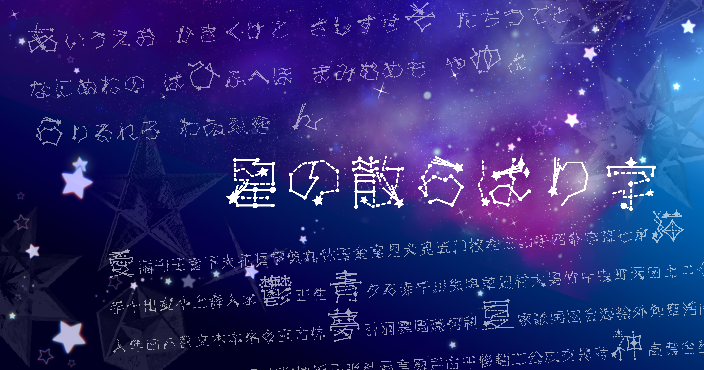

# 星のちらばりじ / Hoshi no Chirabariji

星座や流れ星、輝きをイメージした無料のデザインフォントです。

A free design font inspired by constellations, shooting stars, and sparkling light.

---

## 無料版 / Free Version

このリポジトリには「星のちらばりじ」の無料版が収録されています。

ひらがな、漢字、計1214字ほど入っています。

This repository contains the free version of Hoshi no Chirabariji.

Includes Hiragana and Kanji, with approximately 1,214 characters in total.

---

## 有料版 / Full Version

有料版には、カタカナ、アルファベット、数字、追加記号などが収録されています。

The full version includes additional characters such as Katakana, Latin alphabet, numbers, and additional symbols.

### BOOTH

有料版はこちらから購入できます。

The full version is available on BOOTH.

[BOOTHで有料版を見る / View the full version on BOOTH](https://vo8ov.booth.pm/items/1854583)

---

## 利用規約 / Terms of Use

ご利用前に [TERMS-OF-USE.md](./TERMS-OF-USE.md) をご確認ください。

Please read [TERMS-OF-USE.md](./TERMS-OF-USE.md) before using this font.
